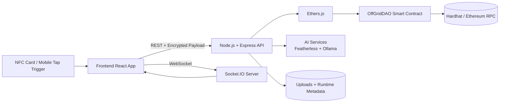
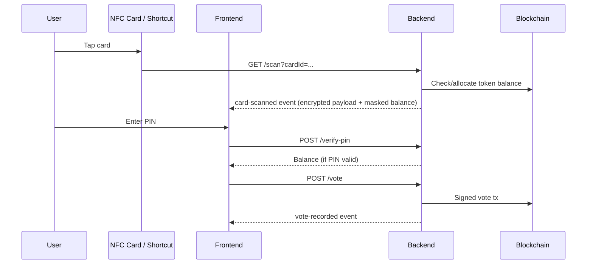
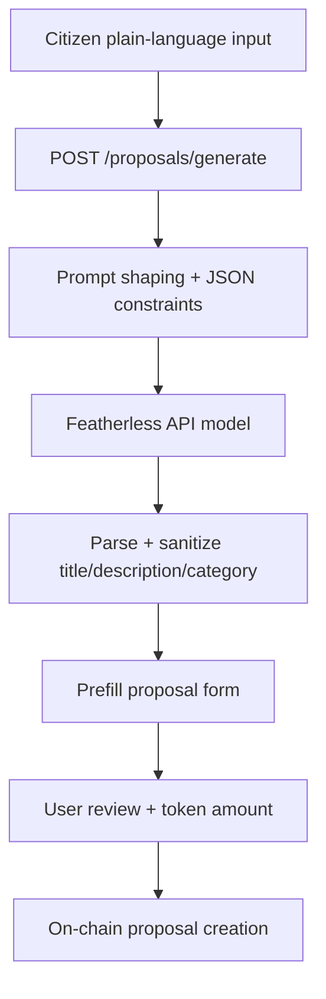
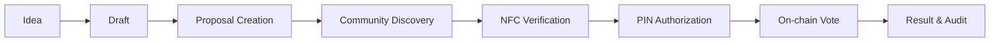

# TapDAO — Tap • Verify • Vote

<p align="center">
  <strong>NFC-powered DAO governance for real-world communities.</strong><br/>
  Accessible Web3 voting for civic bodies, campuses, NGOs, and cooperatives.
</p>

<p align="center">
  
  
  
  
  
</p>

---

## 1) Project Title & Tagline

**TapDAO**  
**Tagline:** _“Physical identity, digital trust, decentralized governance.”_

## 2) Banner / Intro

> TapDAO is an NFC-first governance platform that lets communities vote on blockchain-backed proposals using familiar physical cards and secure PIN-gated wallet unlocking.

**Demo positioning:** open-source showcase + hackathon-grade prototype + research-ready governance infrastructure concept.

---

## 3) Problem Statement

DAO tooling today is designed for crypto-native users, not everyday citizens. Complex wallets, private key handling, and abstract UX create barriers that exclude the majority from decentralized governance.

TapDAO addresses this by replacing wallet-first interaction with **tap-first interaction**.

## 4) Why Current DAO Systems Fail for Mass Adoption

- Wallet onboarding is high-friction.
- Key custody is intimidating for non-technical users.
- Governance interfaces are often inaccessible and jargon-heavy.
- Real-world identity and local governance needs are poorly integrated.
- Most systems assume always-online, desktop-first participation.

## 5) TapDAO Solution Overview

TapDAO combines:
- **NFC card identity trigger**
- **PIN-protected encrypted wallet payloads**
- **On-chain proposal + vote state (Ethereum / Hardhat in current setup)**
- **Real-time sync via Socket.IO**
- **AI-assisted proposal drafting and summarization**

---

## 6) Key Features

- 🪪 NFC card-triggered voter verification (`/scan`)
- 🔐 PIN-based wallet decryption and vote signing (`/verify-pin`, `/vote`)
- 🏛️ On-chain proposals + vote tally (`OffGridDAO.sol`)
- ⚡ Live governance feed over Socket.IO
- 🤖 AI proposal drafting (`/proposals/generate`)
- 🧠 AI proposal problem summarization (`/proposals/summarize-problem`)
- 🖼️ Optional image upload + cropping for proposals
- 🐳 Dockerized multi-service local stack

## 7) Core Innovation

TapDAO bridges **physical civic touchpoints** (NFC cards) and **cryptographic governance rails** (smart contracts), making Web3 participation feel like a familiar public-service workflow.

---

## 8) Real-World Use Cases (India-Focused)

- **Urban wards / panchayat pilots**: neighborhood budget prioritization
- **Colleges**: student council fund allocation and policy voting
- **NGOs**: transparent local program decision-making
- **Cooperatives / SHGs**: member-led governance and grant ranking
- **Housing societies**: maintenance and infrastructure proposals

---

## 9) Complete System Architecture



## 10) End-to-End Workflow Explanation

1. Admin/user creates proposal (manual or AI-assisted).
2. Proposal is stored on-chain via `createProposal`.
3. Voter selects proposal and initiates NFC tap.
4. Backend resolves card identity and prepares encrypted wallet payload.
5. User enters PIN to decrypt wallet key server-side.
6. Vote transaction is signed and submitted on-chain.
7. Updated proposal + transaction feed broadcast in real-time.

## 11) NFC Authentication Flow



## 12) AI Proposal Generation Pipeline



## 13) Smart Contract Architecture

Primary contract: `backend/contracts/OffGridDAO.sol`

- `Proposal` struct (id, title, description, category, fundsRequested, votes, active)
- Global anti-double-vote mapping: `hasVotedGlobally`
- Token ledger: `tokenBalances`
- Initial allocation guard: `isInitialized`
- Proposal counter: `proposalCount`

## 14) Security Architecture

- Payload encryption layer for API exchange (`payload` envelope)
- PIN-verified wallet key decryption prior to sensitive actions
- On-chain validation of proposal existence/activity
- One-vote-per-wallet constraint enforced in smart contract
- Token cost per vote to prevent free spam voting
- Time-bounded sensitive UI states (balance/session auto-hide)

## 15) Encryption & Key Management

### Implemented in current codebase
- **AES encryption** via CryptoJS for transport payload envelope (`backend/lib/crypto.js`, `frontend/src/lib/crypto.js`)
- **PBKDF2 + AES-256-GCM** for card payload encryption/decryption in server flow (`encryptPayload` / `decryptPayload` in `backend/server.js`)

### Recommended production posture
- Use per-user random salts (not static)
- Move secrets to KMS/HSM
- Replace static app secret with rotated env-managed keys
- Use ephemeral signing/session keys and strict key lifecycle controls

---

## 16) Real-Time Sync using Socket.IO

Events emitted:
- `init`
- `proposals-updated`
- `card-scanned`
- `vote-recorded`

This enables live dashboards, instant vote updates, and transaction feed synchronization across clients.

## 17) Technology Stack

| Layer | Technologies |
|---|---|
| Frontend | React 19, Vite, Socket.IO Client, react-easy-crop |
| Backend | Node.js, Express, Socket.IO, Multer |
| Blockchain | Solidity, Hardhat, Ethers.js |
| AI | Featherless (proposal generation), Ollama (summary) |
| Security | CryptoJS AES transport encryption, PBKDF2 + AES-256-GCM wallet payload flow |
| Infra | Docker, Docker Compose |

## 18) Folder Structure

```text
Tap_Dao_Off-Grid/
├── backend/
│   ├── contracts/
│   │   ├── OffGridDAO.sol
│   │   └── SimpleWallet.sol
│   ├── scripts/
│   │   └── deploy.js
│   ├── services/
│   │   └── proposalSummaryService.js
│   ├── lib/
│   │   └── crypto.js
│   ├── server.js
│   ├── hardhat.config.js
│   └── Dockerfile
├── frontend/
│   ├── src/
│   │   ├── App.jsx
│   │   ├── components/ProposalPreviewModal.jsx
│   │   ├── lib/{crypto.js,cropUtils.js}
│   │   └── services/proposalSummaryService.js
│   └── Dockerfile
└── docker-compose.yml
```

## 19) Database Schema Overview

Current implementation is **storage-light** and mostly on-chain/in-memory:

- **On-chain state:** proposals, votes, token balances, initialized wallets
- **In-memory server state:** transaction feed, current voter, proposal image mapping
- **Filesystem state:** uploaded images, deployment metadata (`address.json`)

> For production, move in-memory maps to persistent storage (PostgreSQL/Redis) with audit logs.

## 20) API Routes Documentation

| Method | Route | Purpose |
|---|---|---|
| GET | `/contract` | Contract metadata and ABI |
| GET | `/proposals` | Fetch all proposals |
| POST | `/proposals` | Create on-chain proposal |
| POST | `/proposals/generate` | AI-generate structured proposal draft |
| POST | `/proposals/summarize-problem` | AI summary of proposal problem |
| GET | `/scan?cardId=...` | NFC identity trigger + init token flow |
| GET | `/balance?cardId=...` | Read token balance for card wallet |
| POST | `/verify-pin` | PIN verification + secure balance unlock |
| POST | `/vote` | PIN-gated vote transaction |
| POST | `/upload` | Upload proposal image |

### API example (encrypted POST)

```bash
curl -X POST http://localhost:3001/proposals \
  -H "Content-Type: application/json" \
  -d '{"payload":"<encrypted-json-string>"}'
```

## 21) Smart Contract Functions Overview

| Function | Type | Description |
|---|---|---|
| `createProposal` | write | Adds a proposal |
| `allocateTokens` | write | Initial token allocation |
| `vote` | write | Casts vote; enforces global one-vote rule |
| `getProposal` | read | Returns proposal struct |
| `getTokenBalance` | read | Wallet token balance |
| `proposalCount` | read | Total proposals |
| `hasVotedGlobally` | read | Vote status per wallet |
| `isInitialized` | read | Initial allocation status |

### Contract interaction example (Ethers.js)

```js
const contract = new ethers.Contract(address, abi, signer);
await contract.createProposal("Solar Lights", "Install smart street lights", "Infrastructure", 5000);
await contract.vote(1);
```

---

## 22) Installation Guide

### Prerequisites
- Node.js **20.x LTS** (recommended)
- npm
- Docker + Docker Compose (optional but recommended)

### Install dependencies

```bash
cd backend && npm install
cd ../frontend && npm install
```

## 23) Environment Variables Setup

Create `backend/.env`:

```env
PORT=3001
RPC_URL=http://127.0.0.1:8545
ADDRESS_FILE=./address.json
CRYPTO_SECRET_KEY=replace_with_strong_secret

FEATHERLESS_API_KEY=your_featherless_key
FEATHERLESS_BASE_URL=https://api.featherless.ai/v1
FEATHERLESS_MODEL=meta-llama/Llama-3.2-3B-Instruct

OLLAMA_API_KEY=your_ollama_key_if_using_cloud
OLLAMA_HOST=https://ollama.com
OLLAMA_MODEL=gpt-oss:120b
```

Create `frontend/.env`:

```env
VITE_API_URL=http://localhost:3001
VITE_SOCKET_URL=http://localhost:3001
```

## 24) Docker Compose Setup

```bash
docker compose up -d --build
docker compose ps
docker compose logs -f
```

Services in root compose:
- `hardhat`
- `deploy`
- `app` (backend)
- `frontend`

## 25) Running Locally (Without Docker)

### Terminal A (Blockchain)
```bash
cd backend
npx hardhat node
```

### Terminal B (Deploy + API)
```bash
cd backend
npx hardhat run scripts/deploy.js --network localhost
npm run dev
```

### Terminal C (Frontend)
```bash
cd frontend
npm run dev
```

## 26) Production Deployment Guide

Suggested production blueprint:
1. Deploy audited contracts to target EVM chain.
2. Replace demo hardcoded keys with secure identity wallet provisioning.
3. Run backend behind TLS + reverse proxy.
4. Use managed DB + Redis for durable state and queues.
5. Use KMS/HSM-backed secret and key lifecycle management.
6. Add observability (metrics, tracing, audit logs).
7. Use CI/CD + staged rollouts + infra-as-code.

---

## 27) Screenshots / Demo Placeholders

- _(Placeholder path — create before release)_ `docs/assets/screenshots/dashboard.png`
- _(Placeholder path — create before release)_ `docs/assets/screenshots/proposal-preview.png`
- _(Placeholder path — create before release)_ `docs/assets/screenshots/nfc-flow.png`
- _(Placeholder path — create before release)_ `docs/assets/gifs/tapdao-demo.gif`
- Demo video: _(Placeholder — add public demo URL before release)_

Pre-release checklist:
- [ ] Add screenshot assets to `docs/assets/screenshots/`
- [ ] Add demo GIF to `docs/assets/gifs/`
- [ ] Replace demo URL placeholder with a public link
- [ ] Replace Team section placeholder rows with actual member details
- [ ] Add `LICENSE` file and replace `license-TBD` badge with the selected license

## 28) Architecture Diagram Placeholders

- System context diagram
- Trust boundaries diagram
- Threat model diagram
- Contract state transition diagram

---

## 29) Governance Lifecycle Explanation



## 30) Security Threat Model

Primary risks:
- Stolen card / cloned ID usage
- PIN brute-force attempts
- Replay of encrypted payloads
- API abuse / bot traffic
- Key leakage from weak secret management

Mitigation directions:
- PIN throttling + lockout + anomaly alerts
- Nonce/timestamp request signing
- mTLS or signed device attestations for kiosks
- Hardware-backed key custody
- End-to-end audit trails + SIEM integration

## 31) Scalability Discussion

Scale paths:
- Horizontal backend scaling with sticky or shared Socket.IO adapter
- Redis adapter for pub/sub fanout
- Caching proposal reads
- Queue-based AI request handling
- L2 deployment for lower-cost voting throughput

## 32) Future Roadmap

- Role-based governance modules
- Multi-proposal weighted voting
- Reputation and delegation features
- Verifiable credential integrations
- Multilingual accessibility suite
- Cross-chain governance adapters

## 33) Research & Technical Vision

TapDAO explores a hybrid governance model where **physical identity rituals** and **decentralized execution guarantees** converge. It is positioned as a foundation for inclusive, cryptographically verifiable civic participation systems.

## 34) Challenges Faced During Development

- Balancing Web2 usability with Web3 trust assumptions
- Handling wallet security in NFC-driven UX
- Coordinating real-time state between chain, server, and UI
- Structuring reliable AI outputs into governance-safe templates

---

## 35) Team

> Replace the placeholder rows below with your actual team members before public release.

| Name | Role | Focus |
|---|---|---|
| _Your Name_ | Founder / Engineer | Product, protocol, architecture |
| _Teammate_ | Full-Stack Engineer | Frontend, backend, integrations |
| _Teammate_ | Smart Contract Engineer | Solidity, security, audits |

## 36) Contributors

Contributions are welcome via issues and pull requests.

```bash
# standard contribution flow
git checkout -b feat/your-feature
git commit -m "feat: add your feature"
```

## 37) License

**TBD** — add a `LICENSE` file (MIT/Apache-2.0 recommended for OSS).

## 38) Acknowledgements

- Open-source Ethereum ecosystem
- Hardhat + Ethers.js communities
- React and Socket.IO maintainers
- Civic-tech and DAO research communities

## 39) References / Inspiration

- Ethereum smart contract design patterns
- DAO governance primitives and participation studies
- Human-centered digital public infrastructure approaches

## 40) Final Vision Statement

**TapDAO’s long-term goal is to make decentralized governance as simple as tapping a card—without sacrificing cryptographic trust, transparency, or inclusion.**

---

## Why TapDAO Matters

TapDAO matters because inclusion is the missing layer in most governance tech. By reducing cryptographic friction and meeting communities where they already are (cards, kiosks, local workflows), TapDAO turns decentralized governance from a niche mechanism into a practical civic operating system.

---

## Detailed “How It Works”

<details>
<summary><strong>Expand full operational flow</strong></summary>

1. A proposal is drafted manually or via AI assist.
2. Backend writes proposal to smart contract and broadcasts updates.
3. Voter selects proposal and performs an NFC tap event.
4. Backend resolves card profile and emits encrypted payload.
5. User enters PIN; backend decrypts wallet payload securely.
6. Vote transaction is signed and submitted to chain.
7. Chain-confirmed result is emitted over Socket.IO.
8. UI updates proposal tally and transaction feed in real time.

</details>

---

## Notes for Reviewers

- This repository currently uses a demo-friendly local Hardhat workflow.
- Some security controls are foundational and should be hardened for production.
- This README is designed to serve open-source, hackathon, startup, and research/demo documentation contexts.
